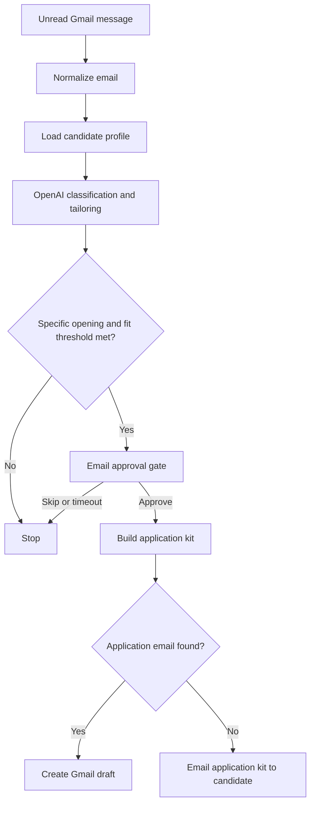

# n8n Gmail Job Application Agent

An importable n8n Cloud workflow that monitors Gmail for specific job openings, evaluates role fit against a candidate profile, prepares truthful application materials with OpenAI, and pauses for human approval.

> [!IMPORTANT]
> This is a human-in-the-loop copilot. It does **not** submit job applications, send recruiter emails, scrape LinkedIn, or invent qualifications. After approval it creates a Gmail draft or sends an application kit to the candidate for final review.

## What it does

- Polls Gmail every five minutes for unread, recent job-related messages.
- Extracts and normalizes the sender, subject, body, date, and Gmail identifiers.
- Uses the OpenAI Responses API to distinguish specific openings from newsletters and generic promotions.
- Scores the opening against target roles, locations, resume content, portfolio, LinkedIn summary, work authorization, and salary preferences.
- Rejects instructions embedded inside email content and treats the email as untrusted input.
- Requires an approve/skip decision by email for sufficiently strong matches.
- Creates a recruiter-ready Gmail **draft** when an application email is available.
- Otherwise emails the candidate an application kit containing the role link, tailored pitch, cover letter, suggested screening answers, and next steps.

## Workflow



## Repository contents

| File | Purpose |
| --- | --- |
| `n8n-gmail-job-application-agent.json` | Importable n8n workflow |
| `README.md` | Setup, testing, publishing, and troubleshooting guide |

## Tech stack

| Technology | Role |
| --- | --- |
| [n8n Cloud](https://n8n.io/cloud/) | Workflow orchestration, scheduling, branching, approvals, and credential management |
| Gmail Trigger and Gmail nodes | Inbox polling, approval emails, application-kit delivery, and recruiter draft creation |
| Google OAuth 2.0 | Secure Gmail authentication through n8n credentials |
| OpenAI Responses API | Job classification, fit scoring, tailored pitches, cover letters, and screening-answer suggestions |
| `gpt-5-mini` | Structured, cost-conscious language-model inference |
| JavaScript | Email normalization, JSON validation, and application-kit assembly in n8n Code nodes |
| n8n expressions and JSON | Dynamic data mapping and portable workflow definition |
| Mermaid | Architecture diagram rendered in GitHub Markdown |

## Prerequisites

- An [n8n Cloud](https://n8n.io/cloud/) workspace.
- A Gmail account that can authorize n8n.
- An OpenAI Platform project with API billing or available credits.
- A current resume in plain text plus a view-only resume link.
- An accurate LinkedIn profile summary or export. This workflow does not scrape LinkedIn.
- A working portfolio URL and a concise summary of the most relevant projects.

ChatGPT subscriptions and OpenAI API billing are separate. The workflow requires an OpenAI API credential unless you deliberately modify the OpenAI step to use another supported n8n authentication path.

## 1. Import the workflow

1. Download `n8n-gmail-job-application-agent.json` from this repository.
2. Sign in to n8n Cloud.
3. Create a new workflow.
4. Open the workflow menu in the upper-right corner.
5. Select **Import from file**.
6. Select the downloaded JSON file.
7. Confirm that 12 nodes appear.
8. Click **Save**.

Do not publish the workflow until the tests below pass.

## 2. Configure the candidate profile

Open **Configure Candidate Profile** and replace every uppercase placeholder.

| Field | Required value |
| --- | --- |
| `approval_email` | Address that receives approval requests and application kits |
| `candidate_name` | Legal or preferred application name |
| `target_roles` | Desired job titles, separated clearly |
| `preferred_locations` | Remote/hybrid preferences and acceptable cities or countries |
| `minimum_fit_score` | Start with `70`; tune after testing |
| `linkedin_profile` | Accurate profile summary: experience, skills, education, certifications, and accomplishments |
| `portfolio_url` | Complete public portfolio URL |
| `portfolio_summary` | Relevant projects, technologies, responsibilities, and measurable results |
| `resume_url` | View-only link to the current resume |
| `resume_text` | Complete text of the current resume |
| `work_authorization` | Truthful work authorization and sponsorship requirements |
| `salary_preferences` | Optional salary expectations, or blank |

Do not store passwords, API keys, government identifiers, banking information, birth dates, or identity documents in the workflow.

Test the resume link in a private browser window. The workflow links to the resume; it does not automatically attach the PDF to Gmail drafts.

## 3. Connect Gmail

Connect one Gmail OAuth credential to all four Gmail nodes:

1. **Watch Gmail for Job Emails**
2. **Email Approval Gate**
3. **Create Recruiter Email Draft**
4. **Send Application Kit to Me**

For each node:

1. Open the node.
2. Find **Credential to connect with**.
3. Create a new Gmail credential on the first node.
4. Select **Sign in with Google** and choose the Gmail account to monitor.
5. Review the requested permissions and complete authorization.
6. Save the credential.
7. Reuse that saved credential in the other Gmail nodes.

If Google authorization fails, verify that Gmail is enabled and that a Google Workspace administrator is not blocking third-party applications.

## 4. Connect OpenAI

1. Sign in to the [OpenAI Platform](https://platform.openai.com/).
2. Configure API billing or available credits.
3. Create a project API key.
4. Copy the key and store it securely. Never commit it to this repository.
5. Open **Analyze and Tailor with OpenAI** in n8n.
6. Create or select an OpenAI API credential.
7. Enter the API key in the n8n credential—not in the workflow body.
8. Save the credential.

The workflow calls `POST https://api.openai.com/v1/responses` with `gpt-5-mini` and requests JSON output.

## 5. Review the Gmail filter

The default Gmail search is:

```text
is:unread newer_than:7d (job OR role OR opening OR opportunity OR recruiter OR hiring OR interview OR application)
```

This intentionally starts broad. After successful testing, a narrower example is:

```text
is:unread newer_than:7d (recruiter OR "job opening" OR "new role" OR "apply now") -category:promotions
```

The trigger only processes unread messages that match the query. Do not add sender restrictions until the relevant alert and recruiter addresses are known.

## 6. Safe test

From another email account, send the following message to the connected Gmail inbox and leave it unread:

```text
Subject: Software Engineer opening at Example Labs

Hello,

Example Labs is hiring a Software Engineer in New York with a hybrid
working arrangement.

Required skills:
- JavaScript or TypeScript
- Node.js
- API development
- Three years of software engineering experience

The role is full-time.

Apply here:
https://example.com/careers/software-engineer

Applications close October 15.

For questions or email applications, contact:
recruiting@example.com
```

The company, URL, and email address are fictional, which keeps the test from producing a real application.

Then:

1. Click **Test workflow** or **Execute workflow** in n8n.
2. Send the sample after the Gmail Trigger begins listening, if necessary.
3. Wait for the polling interval.
4. Inspect **Validate AI Result**.
5. Verify `is_job_opening`, `confidence`, `fit_score`, company, role, URL, email, pitch, and cover letter.
6. Confirm that every generated claim is supported by the configured profile.

If the sample does not pass the threshold, temporarily lower `minimum_fit_score` to `50` for testing, then restore the desired threshold.

## 7. Test both approval paths

### Skip path

1. Click **Skip** in the approval email.
2. Confirm that the execution ends.
3. Confirm that no draft or application kit is created.

### Approval with recruiter email

1. Send another unread copy of the safe test email.
2. Run the test and click **Prepare application**.
3. Confirm that Gmail contains a draft addressed to `recruiting@example.com`.
4. Verify that the draft was not sent.
5. Delete the fictional test draft after inspection.

### Approval with job link only

Send this separate test without a recruiter email:

```text
Subject: Product Manager opening at Sample Company

We are hiring a Product Manager for a remote full-time position.

Details and application:
https://example.com/jobs/product-manager
```

Approve it and confirm that the candidate receives an application-kit email rather than a recruiter draft.

## 8. Publish

Before publishing, verify:

- [ ] Every uppercase placeholder has been replaced.
- [ ] Gmail is connected on all four Gmail nodes.
- [ ] OpenAI authentication succeeds.
- [ ] Resume and portfolio links work in a private browser window.
- [ ] Work authorization and salary preferences are accurate.
- [ ] Generated claims are grounded in the supplied profile.
- [ ] The skip path creates no output.
- [ ] The approval path creates a draft or application kit but sends no application.
- [ ] Fictional drafts from testing have been removed.

Then save the workflow, click **Publish**, review the publishing modal, and click **Publish** again. Send one final safe test message and verify the production execution in n8n's **Executions** view.

## Troubleshooting

### Gmail credential missing

Open the failed Gmail node and select the saved Gmail OAuth credential.

### Gmail trigger receives nothing

- Confirm that the message is unread.
- Confirm that it arrived within seven days.
- Confirm that its subject or body matches at least one Gmail query term.
- Start a manual test before sending a new sample message.

### OpenAI returns `401`

The API key is invalid, revoked, or attached incorrectly. Create a new project key and update only the n8n credential.

### OpenAI returns `429`

The OpenAI project has insufficient credits or has reached a rate limit. Check project billing and usage limits.

### The model is unavailable

Open **Analyze and Tailor with OpenAI** and verify that the request body contains:

```text
model: 'gpt-5-mini'
```

Use a model available to the connected OpenAI project if account availability differs.

### OpenAI returns invalid JSON

Retry once and confirm that the request still contains:

```text
text: { format: { type: 'json_object' } }
```

Also confirm that the system instruction still requires JSON-only output.

### Approval email does not arrive

- Check Spam and Promotions.
- Verify `approval_email`.
- Inspect the execution status.
- Check the connected account's Sent folder.
- Check whether an organization policy blocks automated messages.

### A job email is ignored

Check the unread status, Gmail filter, `confidence`, `fit_score`, and `minimum_fit_score`. The workflow deliberately stops when confidence or fit is below the threshold.

## Security and privacy

- Never commit credentials or personal identity documents.
- Keep the repository workflow generic; enter private candidate data inside your own n8n instance.
- Use a narrowly scoped OpenAI project key and rotate it if exposed.
- Review n8n execution retention because email and resume text can appear in execution data.
- Treat all incoming email text as untrusted.
- Never allow email content to override system rules or candidate facts.
- Review every draft and every generated screening answer.
- Do not use this workflow to misrepresent qualifications or eligibility.

## Limitations

- It does not submit external application forms.
- It does not bypass CAPTCHAs or anti-bot protections.
- It does not scrape LinkedIn or automate LinkedIn Easy Apply.
- It does not attach a resume PDF automatically.
- It cannot guarantee that a job listing is authentic or still active.
- AI-generated drafts require factual and editorial review.

## Customization ideas

- Store processed Gmail message IDs in an n8n Data Table for explicit deduplication.
- Add company and domain allow/deny lists.
- Add a daily digest instead of one approval email per opening.
- Download a resume from approved storage and attach it to the Gmail draft.
- Add a second review step for screening answers containing salary or authorization details.

Keep all submission and recruiter-contact actions behind a human approval step.

## License

This project is licensed under the [MIT License](LICENSE). You may use, copy,
modify, merge, publish, distribute, sublicense, and sell copies of the software
subject to the conditions in the license.
